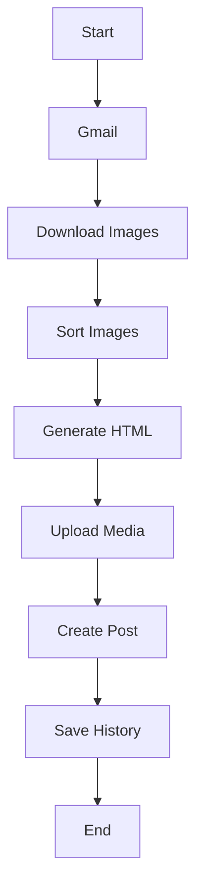
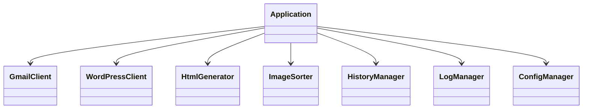

# Mermaid図

## 全体フロー

```mermaid
flowchart TD
A[Start]-->B[Gmail]
B-->C[Download Images]
C-->D[Sort Images]
D-->E[Generate HTML]
E-->F[Upload Media]
F-->G[Create Post]
G-->H[Save History]
H-->I[End]
```

## クラス図

```mermaid
classDiagram
Application --> GmailClient
Application --> WordPressClient
Application --> HtmlGenerator
Application --> ImageSorter
Application --> HistoryManager
Application --> LogManager
Application --> ConfigManager
```
